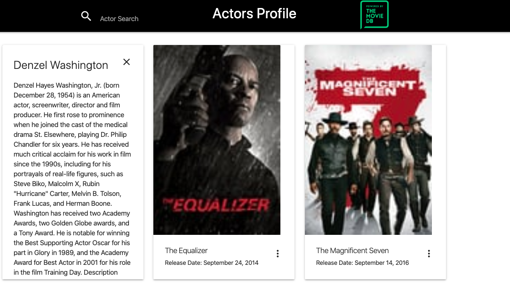

# Description
As part of our first group project, we decided to capitalize on the concept of a robust actor search engine that gives the user a information from the actors birthplace to top movies they were featured in. We designed this app with simplicity in mind and implimented a robust but user friendly interface that skips the clutter and get straight to the point. So if you're like us, and love movies, sit back, relax and browse over 100,000 profiles of talented actors and atresses. Welcome to Actor Profiler.

# Getting Started / Prerequisites
You will need the lastest version of your web browers. Google Chrome is recommended but not required.
Adobe Flash (Chrome users dont need this.)

#  Technologies

### This project was coded using HTML, CSS, and JS.

### Built with Materialize, JQuery and API's.
Server-side APIs - Application programming interface- enables interacting with a third party database or service. For instance, the Google Maps API used in this application enables us to tap into the Google Maps engine to locate where the actor was born.

Git branching workflow - the idea here is that all feature development should take place in a dedicated branch instead of the master branch. This makes it easy for multiple developers to work on a particular feature without disturbing the main codebase.

Agile software development - Based on our combined effort in developing software. Having competent people working together efficiently is key. Good documentation is useful in helping our developers understand how the software is built. This includes a project plan, clean code, etc.

# Demo
Checkout a live demo here!

# License
This product is licensed under MIT.

